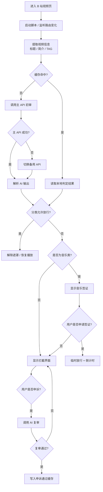

# 架构说明：哔哩哔哩审判庭

本文档面向后续开发者和 AI，用来快速理解 `bili-attn-guardian.user.js` 的内部结构、数据流和扩展方式。

## 1. 项目概览

这是一个运行在 Tampermonkey 中的单文件用户脚本，作用于 B 站视频页 `*://*.bilibili.com/video/*`。

它的目标不是单纯“拦截视频”，而是围绕“注意力保护”建立一套完整流程：

- 采集视频信息
- 调用 AI 分类
- 根据本地配置决定放行或拦截
- 提供申诉与音乐签证
- 通过缓存和备用 API 提升稳定性

## 2. 总体架构图



## 3. 模块拆分

### 3.1 配置与状态

文件开头集中管理所有运行参数和分类规则：

- `getApiConfig()`：读取主/备用 API 配置
- `getVisaConfig()`：读取音乐签证时长和冷却时间
- `getAllowedCategories()`：读取允许放行的分类
- `normalizeCategory()`：统一分类名
- `normalizeAllowedCategories()`：清洗允许分类列表

这些函数构成整个脚本的“规则层”，其他逻辑都基于它们做判断。

### 3.2 分类体系

脚本内置了分类枚举和别名兼容，当前覆盖通用学习、计算机学习、生活实用、游戏干货、游戏娱乐、科技资讯、音乐放松、低价值注意力劫持和信息不足等状态：

- `CATEGORY_OPTIONS`
- `VALID_CATEGORIES`
- `CATEGORY_ALIAS_MAP`
- `APPROVED_BY_APPEAL`

这样做的好处是，旧缓存和旧版 AI 返回结果可以继续兼容，不会因为升级而全部失效。

### 3.3 AI 提示词与结果解析

AI 分类相关的核心是两套提示词，分别对应初审和复审：

**初审**

- `VIDEO_REVIEW_SYSTEM_PROMPT`：定义分类标准、优先级和输出格式
- `createVideoReviewPrompt()`：拼接当前视频的标题、简介和标签

初审模型输出要求是单个 JSON 对象，例如：

```json
{"category":"LEARNING-CS","confidence":0.86,"reason":"一句中文理由"}
```

**复审（申诉）**

- `createAppealReviewPrompt(allowedCategories)`：动态生成复审系统提示词，接收用户在设置中配置的允许放行分类列表，并将其格式化注入提示词，使复审官了解哪些分类可直接批准
- `appealVideoWithAI()`：构建复审请求时，在用户消息中额外注入 AI 初审的分类和理由，供复审官参考

复审用户消息格式：

```
视频标题：xxx
简介：xxx
标签：xxx
AI 初审分类：GAME-ENTERTAINMENT（游戏娱乐），初审理由：xxx

用户申诉理由：xxx
```

复审模型输出格式：批准 `APPROVED`，驳回 `REJECTED|一句中文理由`。

**结果解析链路（初审）**

- `extractJsonObject()`：提取 JSON 片段
- `parseVideoReviewResult()`：解析 AI 输出，兼容旧格式
- `normalizeReviewResult()`：统一缓存值、字符串值和对象值
- `createReviewResult()`：补齐默认理由和置信度

模型输出要求是单个 JSON 对象，例如：

```json
{"category":"LEARNING-CS","confidence":0.86,"reason":"一句中文理由"}
```

### 3.4 AI 请求层

AI 请求封装分三层：

- `requestChatCompletionOnce()`：发送一次请求
- `requestChatCompletionWithRetry()`：失败重试
- `requestChatCompletion()`：主 API 失败后自动切换备用 API

请求目标由以下函数构建：

- `createPrimaryApiTarget()`
- `createBackupApiTarget()`

如果主接口失败，脚本会提示并切换到备用接口；若备用接口也失败，则继续抛错并进入错误遮罩。

### 3.5 视频信息提取

视频信息来源有两类：DOM 与 Meta 标签。

- `extractVideoId(url)`：从 URL 中提取 `BV/av + 分 P`
- `getVideoInfo()`：读取标题、简介、TAG
- `logVideoInfo()`：输出调试日志

选择器做了多路兜底：

- 标题：`h1.video-title`、`.video-title`、`meta[property="og:title"]`
- 简介：`.desc-info-text`、`.video-desc`、`.basic-desc-info`、`meta[name="description"]`
- TAG：多组 tag 选择器 + `meta[name="keywords"]`

### 3.6 播放器控制

播放器控制逻辑很轻：

- `getMainVideoElement()`：定位主视频元素
- `forcePauseVideo()`：持续暂停视频
- `tryPlayVideo()`：尝试恢复播放

在视频被审查期间，脚本会周期性暂停，避免内容先播放一段。

### 3.7 UI 与交互

所有 UI 都是脚本动态注入的 Material 3 风格组件：

- `injectM3Style()`：注入样式
- `showToast()`：提示消息
- `showPendingMask()`：审查中遮罩
- `showErrorMask()`：异常遮罩
- `showBlocker()`：拦截界面
- `openSettings()`：综合配置面板
- `openApiSettings()`：仅 API 配置面板
- `ensureApiConfigFab()`：左下角配置按钮

### 3.8 业务判断

业务判断围绕三种结果展开：

- 允许放行
- 拦截并提示
- 临时许可

对应函数：

- `checkVideoWithAI()`：初审，调用 AI 对视频进行首次分类
- `appealVideoWithAI(title, desc, tags, reason, initialReview, allowedCategories)`：复审，接收用户申诉理由、AI 初审结果和用户设置的允许分类，调用 AI 进行二次裁决
- `showBlocker()`：拦截页与申诉入口，展示初审结果和提供申诉通道

### 3.9 主流程与路由监听

主执行入口是 `main()`，它和以下函数配合：

- `triggerMainDebounced()`：防抖启动
- `resetRuntimeForNavigation()`：切页重置
- `handleVideoRouteChange()`：监听路由变化
- `startGuardian()`：首次启动

监听方式包括：

- `MutationObserver`
- `history.pushState`
- `history.replaceState`
- `window.popstate`
- `DOMContentLoaded` / `load` / 延迟启动

## 4. 运行流程

完整流程可以概括为：

1. 进入 B 站视频页。
2. `startGuardian()` 检查当前 URL 是否为视频页。
3. `main()` 开始工作，等待标题和标签加载完成。
4. 提取视频信息后，先查本地缓存。
5. 若缓存命中，直接使用缓存结果。
6. 若未命中，调用 AI 初审。
7. 解析 AI 返回，规范化为内部分类结果。
8. 若分类在允许列表中，直接放行。
9. 若分类为 `MUSIC`，进入音乐签证逻辑。
10. 若分类不允许，显示拦截遮罩。
11. 若用户发起申诉，调用 AI 复审。
12. 申诉通过后写入缓存，下次可直接放行。
13. 视频切换时，监听器会清理状态并重新审查。

## 5. 存储键值

脚本通过 Tampermonkey 的 `GM_getValue` / `GM_setValue` 持久化以下数据：

### 5.1 API 配置

- `ai_focus_key`
- `ai_focus_endpoint`
- `ai_focus_model`
- `ai_focus_backup_key`
- `ai_focus_backup_endpoint`
- `ai_focus_backup_model`

### 5.2 规则配置

- `ai_focus_allowed_categories`
- `ai_focus_music_duration`
- `ai_focus_music_cooldown`
- `ai_focus_music_last_time`

### 5.3 视频缓存

- `ai_focus_cache_${videoId}`

缓存内容会被序列化成标准对象格式：

```json
{"category":"LEARNING-CS","confidence":0.86,"reason":"..."}
```

## 6. 开发注意事项

### 6.1 修改分类时

如果新增或调整分类，需要同步修改：

- `CATEGORY_OPTIONS`
- `VALID_CATEGORIES`
- `CATEGORY_ALIAS_MAP`
- `VIDEO_REVIEW_SYSTEM_PROMPT`（初审系统提示词）
- `createAppealReviewPrompt()`（复审系统提示词生成函数）

### 6.2 修改页面选择器时

优先检查 B 站页面结构是否变化，再更新：

- `getVideoInfo()`
- `extractVideoId()`
- 路由监听逻辑

### 6.3 接入新的 AI 服务时

只要是 OpenAI-compatible 接口，通常只需要调整：

- `ai_focus_endpoint`
- `ai_focus_model`
- 必要时补充备用 API

### 6.4 修改 UI 时

UI 是纯脚本生成的，尽量保持：

- 样式集中在 `injectM3Style()`
- 结构集中在 `showPendingMask()` / `showBlocker()` / `openSettings()`
- 交互逻辑独立封装，避免散落在主流程中

## 7. 风险与兜底策略

脚本默认偏保守，常见兜底包括：

- 抓不到标题时，认为页面未完全加载
- AI 返回非 JSON 时，按 `UNKNOWN` 处理
- 主 API 失败时自动切备用 API
- 申诉失败时继续拦截，不默认放行
- 缓存异常时回退到重新审查

## 8. 后续阅读顺序建议

如果要快速上手源码，建议按这个顺序读：

1. 配置与分类定义
2. AI 提示词与结果解析
3. 请求封装与备用 API
4. 视频信息提取与缓存
5. 主流程 `main()`
6. 遮罩 UI 与申诉/音乐签证
7. 路由监听与重置

## 9. 文件关系

- `README.md`：面向用户的简介、功能、安装和使用说明
- `ARCHITECTURE.md`：面向开发者/AI 的架构说明
- `bili-attn-guardian.user.js`：唯一运行脚本
