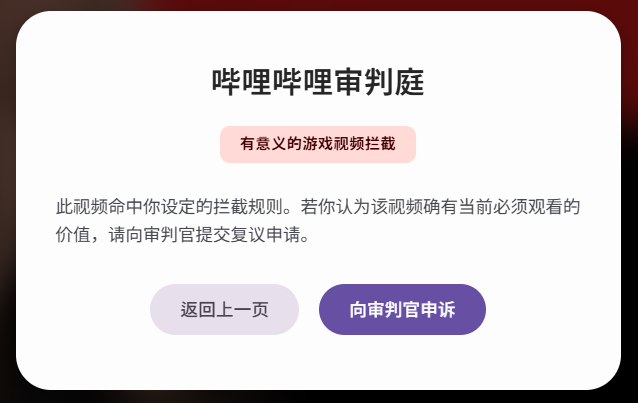
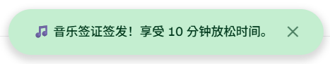

# 哔哩哔哩审判庭
#### Bilibili Attention Guardian

这是一个用于 B 站视频页的 Tampermonkey 油猴脚本。

它会根据视频标题、简介和标签，调用 AI 判断当前内容是否适合继续观看，并在学习场景下自动拦截容易分散注意力的视频，同时保留“申诉”和“音乐签证”等灵活机制。

## 主要功能

- AI 智能拦截娱乐或低价值内容
- 支持自定义放行分类
- 支持主 API 与备用 API
- 支持本地缓存，减少重复请求
- 支持申诉复审
- 支持音乐类视频的短期放松许可
- 支持 B 站 SPA 页面切换后的自动重审

## 使用方式

1. 安装 Tampermonkey
2. 新建脚本并导入 `bili-attn-guardian.user.js`
3. 打开任意 B 站视频页
4. 点击左下角 `⚖` 按钮或菜单项进行 API 配置
5. 保存后即可开始使用

## 配置说明

### AI API

至少需要填写：

- API Key
- API Endpoint
- Model

如需备用接口，也可以继续填写备用 Key、Endpoint 和 Model。

### 分类放行

你可以选择哪些分类无条件放行，比如：

- 通用学习
- 计算机学习
- 游戏干货
- 科技资讯

### 音乐签证

如果你希望音乐类内容短暂放行，可以设置：

- 单次时长：1~10 分钟
- 冷却时间：最少 1 分钟

## 效果预览

### 智能拦截

### 自定义选项

### 临时签证 - 适当放松

## 文档

如果你想了解这个脚本的详细架构、模块拆分、执行流程和数据流，请查看：

- [架构说明](./ARCHITECTURE.md)

## 版本信息

- 脚本版本：`1.3.5`
- 作者：`Misaka Milobo(By Gemini and ChatGPT)`
